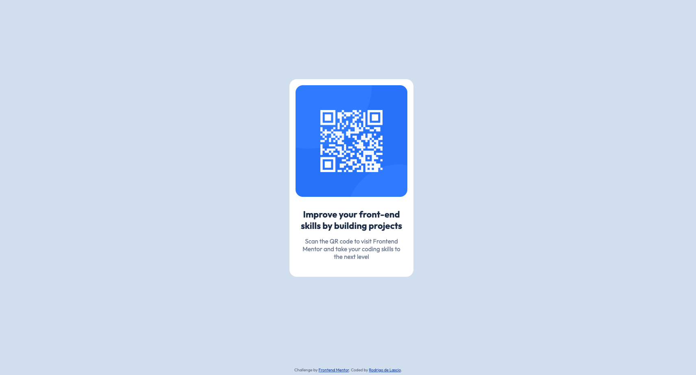

# QR-Code-Component

- [Overview](#overview)
- [Screenshot](#screenshot)
- [Links](#links)
- [Built with](#built-with)
- [Author](#author)

## Overview

A QR Code component comprised of a card, with the code, a title and a paragraph.

## Screenshot

## Links

- Live Site: [URL](https://rodrigodelascio.github.io/QR-Code-Component/)

## Built with

- HTML5
- CSS custom properties
- Flexbox

## Author

- Website - [Rodrigo de Lascio](https://rodrigodelascio.co.uk/)
- Frontend Mentor - [@rodrigodelascio](https://www.frontendmentor.io/profile/rodrigodelascio)
- GitHub - [@rodrigodelascio](https://github.com/rodrigodelascio)
- LinkedIn - [@rodrigodelascio](https://www.linkedin.com/in/rodrigo-de-lascio/)
